# 事件相机CVPR2025相关论文：

**计划：**

1. 读完所有论文的abstract，为这些论文大致分类，做完这一步就可以考虑发布了（6h）
2. 细读感兴趣方向的论文，做Paper reading并另外发布（2h*[4-8])

**论文列表：**

---

- [**Event Ellipsometer: Event-based Mueller-Matrix Video Imaging**](https://openaccess.thecvf.com/content/CVPR2025/papers/Maeda_Event_Ellipsometer_Event-based_Mueller-Matrix_Video_Imaging_CVPR_2025_paper.pdf)

> Light-matter interactions modify both the intensity and polarization state of light. Changes in polarization, represented by a Mueller matrix[2], encode detailed scene information. Existing optical ellipsometers[1] capture Muellermatrix images; however, they are often limited to capturing static scenes due to long acquisition times. Here, we introduce Event Ellipsometer, a method for acquiring a Muellermatrix video for dynamic scenes. Our imaging system employs fast-rotating quarter-wave plates (QWPs) in front of a light source and an event camera that asynchronously captures intensity changes induced by the rotating QWPs. We develop an ellipsometric-event image formation model, a calibration method, and an ellipsometric-event reconstruction method. We experimentally demonstrate that Event Ellipsometer enables Mueller-matrix video imaging at 30 fps, extending ellipsometry to dynamic scenes

1. 椭偏仪（ellipsometer）通过测量**偏振光在材料表面反射或透射后偏振状态的变化**，来推断材料的厚度、折射率 $n$、消光系数 $k$ 等光学参数。
2. Mueller 矩阵是一个 **4×4 的实数矩阵**，它把光的输入偏振状态（以 Stokes 向量表示）变换为输出偏振状态。

+Highlight +计算成像 -深度学习

- [**EventSplat: 3D Gaussian Splatting from Moving Event Cameras for Real-time Rendering**](https://openaccess.thecvf.com/content/CVPR2025/papers/Yura_EventSplat_3D_Gaussian_Splatting_from_Moving_Event_Cameras_for_Real-time_CVPR_2025_paper.pdf)

> We introduce a method for using event camera data in novel view synthesis via Gaussian Splatting. Event cameras offer exceptional temporal resolution and a high dynamic range. Leveraging these capabilities allows us to effectively address the novel view synthesis challenge in the presence of fast camera motion. For initialization of the optimization process, our approach uses prior knowledge encoded in an event-to-video model. We also use spline interpolation[1] for obtaining high quality poses along the event camera trajectory. This enhances the reconstruction quality from fast-moving cameras while overcoming the computational limitations traditionally associated with event-based Neural Radiance Field (NeRF) methods. Our experimental evaluation demonstrates that our results achieve higher visual fidelity and better performance than existing eventbased NeRF approaches while being an order of magnitude faster to render.

1. Spline 插值的目标是构造一条**平滑曲线**，穿过这些点，但不像高阶多项式插值那样出现剧烈振荡（Runge 现象）

+NVS +3D高斯泼溅

- **[EBS-EKF: Accurate and High Frequency Event-based Star Tracking](https://kitware.github.io/nest-project-page/)**

> Event-based sensors (EBS) are a promising new technology for star tracking due to their low latency and power efficiency, but prior work has thus far been evaluated exclusively in simulation with simplified signal models. We propose a novel algorithm for event-based star tracking, grounded in an analysis of the EBS circuit and an extended Kalman filter (EKF). We quantitatively evaluate our method using real night sky data, comparing its results with those from a space-ready active-pixel sensor (APS) star tracker. We demonstrate that our method is an order-of-magnitude more accurate than existing methods due to improved signal modeling and state estimation, while providing more frequent updates and greater motion tolerance than conventional APS trackers. We provide all code* and the first dataset of events synchronized with APS solutions.

+Highlight +RGB +系统设计

- **[EvEnhancer: Empowering Effectiveness, Efficiency and Generalizability for Continuous Space-Time Video Super-Resolution with Events](https://w-shuoyan.github.io/EvEnhancer.gitub.io/)**

> Continuous space-time video **super-resolution** (C-STVSR) endeavors to upscale videos simultaneously at arbitrary spatial and temporal scales, which has recently garnered increasing interest. However, **prevailing methods struggle to yield satisfactory videos at out-of-distribution spatial and temporal scales**. On the other hand, event streams characterized by high temporal resolution and high dynamic range, exhibit compelling promise in vision tasks. This paper presents EvEnhancer, an innovative approach that marries the unique advantages of event streams to elevate effectiveness, efficiency, and generalizability for C-STVSR. Our approach hinges on two pivotal components: 1) Event-adapted synthesis capitalizes on the spatiotemporal correlations between frames and events to discern and learn long-term motion trajectories, enabling the adaptive interpolation and fusion of informative spatiotemporal features; 2) Local implicit video transformer integrates local implicit video neural function with cross-scale spatiotemporal attention to learn continuous video representations utilized to generate plausible videos at arbitrary resolutions and frame rates. Experiments show that EvEnhancer achieves superiority on synthetic and real-world datasets and preferable generalizability on out-of-distribution scales against state-of-the-art methods. Code is available at [this https URL](https://github.com/W-Shuoyan/EvEnhancer).

+Highlight +超分辨率

- [**Graph Neural Network Combining Event Stream and Periodic Aggregation for Low-Latency Event-based Vision**](https://openaccess.thecvf.com/content/CVPR2025/papers/Dampfhoffer_Graph_Neural_Network_Combining_Event_Stream_and_Periodic_Aggregation_for_CVPR_2025_paper.pdf)

> Event-based cameras asynchronously detect changes in light intensity with high temporal resolution, making them a promising alternative to RGB camera for low-latency and low-power optical flow estimation. However, state-of-theart convolutional neural network methods create frames from the event stream, therefore losing the opportunity to exploit events for both sparse computations and low-latency prediction. On the other hand, asynchronous event graph methods could leverage both, but at the cost of avoiding any form of time accumulation, which limits the prediction accuracy. In this paper, we propose to **break this accuracylatency trade-off** with a novel architecture combining an asynchronous accumulation-free event branch and a periodic aggregation branch. The periodic branch performs feature aggregations on the event graphs of past data to extract global context information, which improves accuracy without introducing any latency. The solution could predict optical flow per event with a latency of tens of microseconds on asynchronous hardware, which represents a gain of three orders of magnitude with respect to state-of-the-art frame-based methods, with 48x less operations per second. We show that the solution can detect rapid motion changes faster than a periodic output. This work proposes, for the first time, an effective solution for ultra low-latency and low-power optical flow prediction from event cameras.

+Highlight +光流估计 +GNN +异步分析

- **[Object Detection using Event Camera: A MoE Heat Conduction based Detector and A New Benchmark Dataset](https://github.com/Event-AHU/OpenEvDET)**

> Object detection in event streams has emerged as a cuttingedge research area, demonstrating superior performance in low-light conditions, scenarios with motion blur, and rapid movements. Current detectors leverage spiking neural networks, Transformers, or convolutional neural networks as their core architectures, each with its own set of limitations including restricted performance, high computational overhead, or limited local receptive fields. This paper introduces a novel MoE (Mixture of Experts) heat conduction[1] based object detection algorithm that strikingly balances accuracy and computational efficiency. Initially, we employ a stem network for event data embedding, followed by processing through our innovative MoE-HCO blocks. Each block integrates various expert modules to mimic heat conduction within event streams. Subsequently, an IoUbased query selection module is utilized for efficient token extraction, which is then channeled into a detection head for the final object detection process. Furthermore, we are pleased to introduce EvDET200K, a novel benchmark dataset for event-based object detection. Captured with a high-definition Prophesee EVK4-HD event camera, this dataset encompasses 10 distinct categories, 200,000 bounding boxes, and 10,054 samples, each spanning 2 to 5 seconds. We also provide comprehensive results from over 15 state-of-the-art detectors, offering a solid foundation for future research and comparison. The source code has been released on: https://github.com/Event-AHU/OpenEvDET

1. “热传导”原本是物理上的扩散过程，这种思想在神经网络中常被引申为**信息平滑/扩散机制**。

+目标检测 +MoE +数据集

- **[On-Device Self-Supervised Learning of Low-Latency Monocular Depth from Only Events](https://mavlab.tudelft.nl/depth_from_events/)**

> Event cameras provide low-latency perception for only milliwatts of power. This makes them highly suitable for resource-restricted, agile robots such as small flying drones. Self-supervised learning based on contrast maximization holds great potential for event-based robot vision, as it foregoes the need for high-frequency ground truth and allows for online learning in the robot’s operational environment. However, **online, on-board learning** raises the major challenge of achieving sufficient computational efficiency for real-time learning, while maintaining competitive visual perception performance. In this work, we improve the time and memory efficiency of the contrast maximization pipeline, making on-device learning of low-latency monocular depth possible. We demonstrate that online learning on board a small drone yields more accurate depth estimates and more successful obstacle avoidance behavior compared to only pre-training. Benchmarking experiments show that the proposed pipeline is not only efficient, but also achieves state-of-the-art depth estimation performance among self-supervised approaches. Our work taps into the unused potential of online, on-device robot learning, promising smaller reality gaps and better performance.

+深度估计 +在线学习 +自监督

- [**EZSR: Event-based Zero-Shot Recognition** ](https://arxiv.org/pdf/2407.21616)

> This paper studies zero-shot object recognition using event camera data. Guided by CLIP, which is pre-trained on RGB images, existing approaches achieve zero-shot object recognition by optimizing embedding similarities between event data and RGB images respectively encoded by an event encoder and the CLIP image encoder. Alternatively, several methods learn RGB frame reconstructions from event data for the CLIP image encoder. However, they often result in suboptimal zero-shot performance. This study develops an event encoder without relying on additional reconstruction networks. We theoretically analyze the performance bottlenecks of previous approaches: the embedding optimization objectives are prone to suffer from the spatial sparsity of event data, causing semantic misalignments between the learned event embedding space and the CLIP text embedding space. To mitigate the issue, we explore a scalar-wise modulation strategy. Furthermore, to scale up the number of events and RGB data pairs for training, we also study a pipeline for synthesizing event data from static RGB images in mass. Experimentally, we demonstrate an attractive scaling property in the number of parameters and synthesized data. We achieve superior zero-shot object recognition performance on extensive standard benchmark datasets, even compared with past supervised learning approaches. For example, our model with a ViT/B-16 backbone achieves 47.84% zero-shot accuracy on the N-ImageNet dataset.

+目标检测 +Zero-shot +自监督

- **[Efficient Event-Based Object Detection: A Hybrid Neural Network with Spatial and Temporal Attention](https://soikathasanahmed.github.io/hybrid/)**

> Event cameras offer high temporal resolution and dynamic range with minimal motion blur, making them promising for robust object detection. While Spiking Neural Networks (SNNs) on neuromorphic hardware are often considered for energy-efficient and low latency event-based data processing, they often fall short of Artificial Neural Networks (ANNs) in accuracy and flexibility. Here, we introduce **Attention-based Hybrid SNN-ANN backbones** for event-based object detection to leverage the strengths of both SNN and ANN architectures. A novel Attention-based SNN-ANN bridge module captures sparse spatial and temporal relations from the SNN layer and converts them into dense feature maps for the ANN part of the backbone. Additionally, we present a variant that integrates DWConvL-STMs to the ANN blocks to capture slower dynamics. This multi-timescale network combines fast SNN processing for short timesteps with long-term dense RNN processing, effectively capturing both fast and slow dynamics. Experimental results demonstrate that our proposed method surpasses SNN-based approaches by significant margins, with results comparable to existing ANN and RNN-based methods. Unlike ANN-only networks, the hybrid setup allows us to implement the SNN blocks on digital neuromorphic hardware to investigate the feasibility of our approach. Extensive ablation studies and implementation on neuromorphic hardware confirm the effectiveness of our proposed modules and architectural choices. Our hybrid SNN-ANN architectures pave the way for ANN-like performance at a drastically reduced parameter, latency, and power budget.

+目标检测 +SNN

- [**PS-EIP: Robust Photometric Stereo Based on Event Interval Profile**](https://arxiv.org/pdf/2503.18341)

> Recently, the energy-efficient photometric stereo method using an event camera (EventPS [67]) has been proposed to recover surface normals from events triggered by changes in logarithmic Lambertian reflections[1] under a moving directional light source. However, EventPS treats each event interval independently, making it sensitive to noise, shadows, and non-Lambertian reflections. This paper proposes Photometric Stereo based on Event Interval Profile (PS-EIP), a robust method that recovers pixelwise surface normals from a time-series profile of event intervals. By exploiting the continuity of the profile and introducing an outlier detection method based on profile shape, our approach enhances robustness against outliers from shadows and specular reflections. Experiments using real event data from 3D-printed objects demonstrate that PS-EIP significantly improves robustness to outliers compared to EventPS’s deep-learning variant, EventPS-FCN, without relying on deep learning.

1. “**Photometric Stereo**”（光度立体）是一种经典的 **三维重建技术**，它通过在**固定视角**下，用**不同方向的光照**拍摄多张图像，来推断物体表面的**法向量（surface normal）**和进而推导出 **3D形状**。
2. “**Lambertian reflections**”（兰伯特反射）是计算机视觉、图形学、物理光学中一个非常基础但极为重要的概念，用来描述**理想漫反射表面**的光照模型。**Lambertian 表面**指的是那种**从任意角度看起来亮度都一样**的表面 —— 它把入射光均匀地向所有方向散射。“**Non-Lambertian Effects**”（**非兰伯特反射效应**）是指**现实世界中不满足 Lambertian 漫反射模型的光照行为**

+三维重建 -深度学习

- [**EventPSR: Surface Normal and Reflectance Estimation from Photometric Stereo Using an Event Camera**](https://openaccess.thecvf.com/content/CVPR2025/papers/Yu_EventPSR_Surface_Normal_and_Reflectance_Estimation_from_Photometric_Stereo_Using_CVPR_2025_paper.pdf)

> Simultaneously acquisition of the surface normal and reflectance parameters is a crucial but challenging technique in the field of computer vision and graphics. It requires capturing multiple high dynamic range (HDR) images in existing methods using frame-based cameras. In this paper, we propose EventPSR, the first work to recover **surface normal** and **reflectance parameters** (e.g., metallic and roughness) simultaneously using an event camera. Compared with the existing methods based on photometric stereo or neural radiance fields, EventPSR is a robust and efficient approach that works consistently with different materials. Thanks to the extremely high temporal resolution and high dynamic range coverage of event cameras, EventPSR can recover accurate surface normal and reflectance of objects with various materials in 10 seconds. Extensive experiments on both synthetic data and real objects show that compared with existing methods using more than 100 HDR images, EventPSR recovers comparable surface normal and reflectance parameters with only about 30% of the data rate.

+Highlight +表面重建 

- [**S2D-LFE: Sparse-to-Dense Light Field Event Generation**](https://openaccess.thecvf.com/content/CVPR2025/papers/Liu_S2D-LFE_Sparse-to-Dense_Light_Field_Event_Generation_CVPR_2025_paper.pdf)

> In this paper, we present S2D-LFE, an innovative approach for sparse-to-dense light field event generation. For the first time to our knowledge, S2D-LFE enables controllable **novel view synthesis** only from sparse-view light field event (LFE) data, and addresses three critical challenges for the LFE generation task: simplicity, controllability, and consistency. The simplicity aspect eliminates the dependency on frame-based modality, which often suffers from motion blur and low frame-rate limitations. The controllability aspect enables precise view synthesis under sparse LFE conditions with view-related constraints. The consistency aspect ensures both cross-view and temporal coherence in the generated results. To realize S2D-LFE, we develop a novel **diffusion-based generation network** with two key components. First, we design an LFE-customized variational auto-encoder that effectively compresses and reconstructs LFE by integrating cross-view information. Second, we design an LFE-aware injection adaptor to extract comprehensive geometric and texture priors. Furthermore, we construct a large-scale synthetic LFE dataset containing 162 one-minute sequences using simulator, and capture a real-world testset using our custom-built sparse LFE acquisition system, covering diverse indoor and outdoor scenes. Extensive experiments demonstrate that S2D-LFE successfully generates up to 9x9 dense LFE from sparse 2x2 inputs and outperforms existing methods on both synthetic and real-world data. The datasets and code are available at https://github.com/Yutong2022/S2D-LFE.

+生成事件 +NVS

- **[Full-DoF Egomotion Estimation for Event Cameras Using Geometric Solvers](https://github.com/jizhaox/relpose-event)**

> For event cameras, current sparse geometric solvers for egomotion estimation assume that the rotational displacements are known, such as those provided by an IMU. Thus, they can only recover the translational motion parameters. Recovering full-DoF motion parameters using a sparse geometric solver is a more challenging task, and has not yet been investigated. In this paper, we propose several solvers to estimate both rotational and translational velocities within a unified framework. Our method leverages event manifolds induced by line segments. The problem formulations are based on either an incidence relation for lines or a novel coplanarity relation for normal vectors. We demonstrate the possibility of recovering fullDoF egomotion parameters for both angular and linear velocities without requiring extra sensor measurements or motion priors. To achieve efficient optimization, we exploit the Adam framework with a first-order approximation of rotations for quick initialization. Experiments on both synthetic and real-world data demonstrate the effectiveness of our method. The code is available at https: //github.com/jizhaox/relpose-event.

+Highlight +自动作估计 -深度学习

- **[Repurposing Pre-trained Video Diffusion Models for Event-based Video Interpolation](https://vdm-evfi.github.io/)**

> Video Frame Interpolation aims to recover realistic missing frames between observed frames, generating a high-frame-rate video from a low-frame-rate video. However, without additional guidance, the large motion between frames makes this problem ill-posed. Event-based Video Frame Interpolation (EVFI) addresses this challenge by using sparse, high-temporal-resolution event measurements as motion guidance. This guidance allows EVFI methods to significantly outperform frame-only methods. However, to date, EVFI methods have relied on a limited set of paired event-frame training data, severely limiting their performance and generalization capabilities. In this work, we overcome the limited data challenge by adapting pre-trained video diffusion models trained on internet-scale datasets to EVFI. We experimentally validate our approach on real-world EVFI datasets, including a new one that we introduce. Our method outperforms existing methods and generalizes across cameras far better than existing approaches.

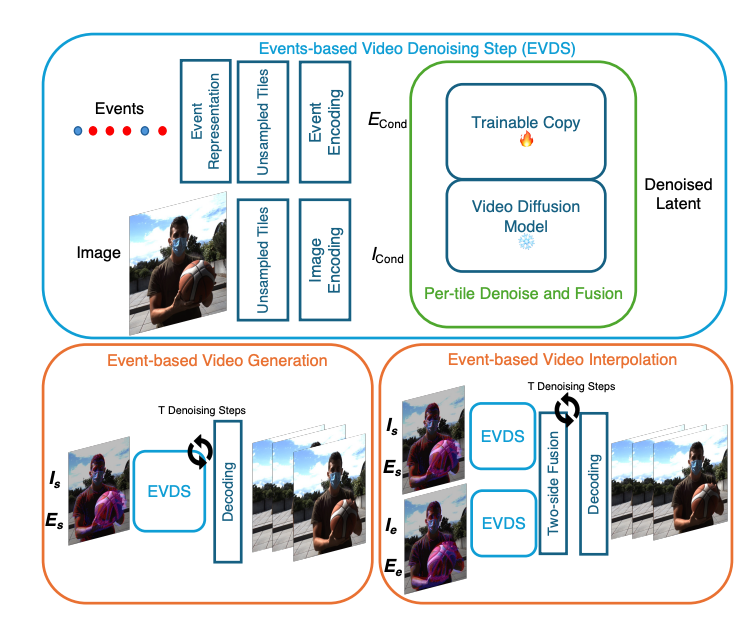

+视频插帧 +扩散模型 +RGB

- [**Active Hyperspectral Imaging Using an Event Camera**](https://openaccess.thecvf.com/content/CVPR2025/papers/Yu_Active_Hyperspectral_Imaging_Using_an_Event_Camera_CVPR_2025_paper.pdf

> Hyperspectral imaging[1] plays a critical role in numerous scientific and industrial fields. Conventional hyperspectral imaging systems often struggle with the trade-off between capture speed, spectral resolution, and bandwidth, particularly in dynamic environments. In this work, we present a novel event-based active hyperspectral imaging system designed for real-time capture with low bandwidth in dynamic scenes. By combining an event camera with a dynamic illumination strategy, our system achieves unprecedented temporal resolution while maintaining high spectral fidelity, all at a fraction of the bandwidth requirements of traditional systems. Unlike basis-based methods that sacrifice spectral resolution for efficiency, our approach enables continuous spectral sampling through an innovative “sweeping rainbow” illumination pattern synchronized with a rotating mirror array. The key insight is leveraging the sparse, asynchronous nature of event cameras to encode spectral variations as temporal contrasts, effectively transforming the spectral reconstruction problem into a series of geometric constraints. Extensive evaluations of both synthetic and real data demonstrate that our system outperforms state-ofthe-art methods in temporal resolution while maintaining competitive spectral reconstruction quality.

1. 高光谱成像就是为图像中的**每个像素**记录一条完整的**光谱曲线**，不仅告诉你“这是什么颜色”，还告诉你“它在每个波长上反射/发射了多少”。

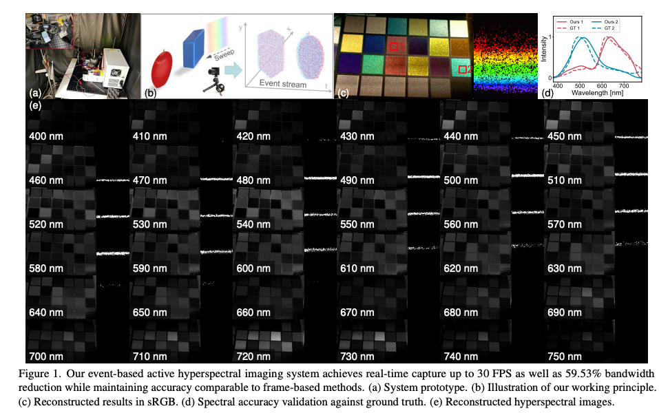

+Highlight +计算成像

- [**Diffusion-based Event Generation for High-Quality Image Deblurring** ](https://openaccess.thecvf.com/content/CVPR2025/papers/Xie_Diffusion-based_Event_Generation_for_High-Quality_Image_Deblurring_CVPR_2025_paper.pdf)

> While event-based deblurring have demonstrated impressive results, they are impractical for consumer photos captured by cell phones and digital cameras that are not equipped with the event sensor. To address this problem, we in this paper propose a novel deblurring framework called Event Generation Deblurring (EGDeblurring), which allows to effectively deblur an image by **generating event guidance** describing the motion information using a diffusion model. Specifcally, we design a motion prior generation diffusion model and a feature extractor to produce prior information benefcial for deblurring, rather than generating the raw event representation. In order to achieve effective fusion of motion prior information with blurry images and produce high-quality results, we develop a regression deblurring network embedded with a dualattention channel fusion block. Experiments on multiple datasets demonstrate that our method outperforms state-of-the-art image deblurring methods. Our code is available at https://github.com/XinanXie/EGDeblurring.

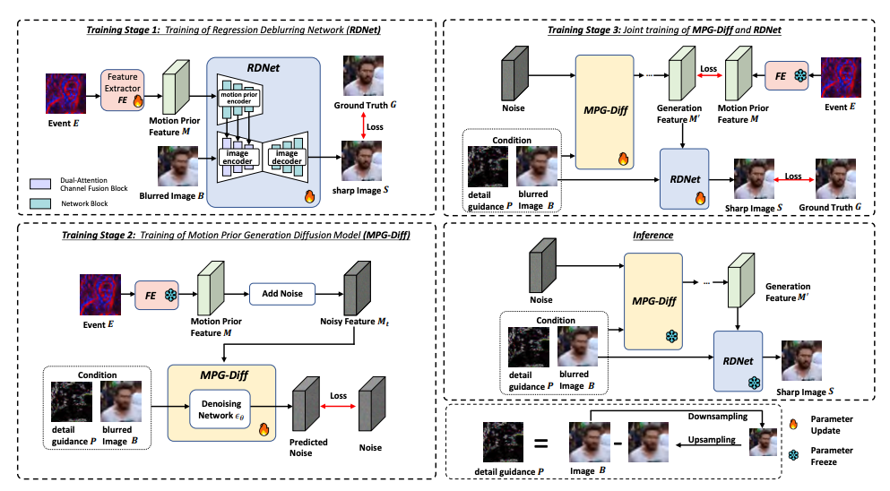

+去模糊 +扩散模型 +RGB

- [**IncEventGS: Pose-Free Gaussian Splatting from a Single Event Camera**](https://arxiv.org/pdf/2410.08107)

> Implicit neural representation and explicit 3D Gaussian Splatting (3D-GS) for novel view synthesis have achieved remarkable progress with frame-based camera (e.g. RGB and RGBD cameras) recently. Compared to frame-based camera, a novel type of bio-inspired visual sensor, i.e. event camera, has demonstrated advantages in high temporal resolution, high dynamic range, low power consumption, and low latency, which make it favored for many robotic applications. In this work, we present IncEventGS, an incremental 3D Gaussian Splatting reconstruction algorithm with a single event camera, without the assumption of known camera poses. To recover the 3D scene representation incrementally, **we exploit the tracking and mapping paradigm of conventional SLAM pipelines for IncEventGS**. Given the incoming event stream, the tracker first estimates an initial camera motion based on prior reconstructed 3D-GS scene representation. The mapper then jointly refines both the 3D scene representation and camera motion based on the previously estimated motion trajectory from the tracker. The experimental results demonstrate that IncEventGS delivers superior performance compared to prior NeRF-based methods and other related baselines, even if we do not have the ground-truth camera poses. Furthermore, our method can also deliver better performance compared to state-of-the-art event visual odometry methods in terms of camera motion estimation.

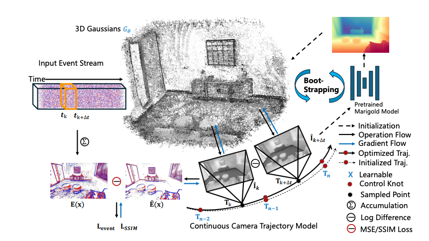

+Highlight +3DGS +SLAM

- [**TimeTracker: Event-based Continuous Point Tracking for Video Frame Interpolation with Non-linear Motion**](https://arxiv.org/pdf/2505.03116)

> Video frame interpolation (VFI) that leverages the bioinspired event cameras as guidance has recently shown better performance and memory efficiency than the frame-based methods, thanks to the event cameras’ advantages, such as high temporal resolution. A hurdle for event-based VFI is how to effectively deal with non-linear motion, caused by the dynamic changes in motion direction and speed within the scene. Existing methods either use events to estimate sparse optical flow or fuse events with image features to estimate dense optical flow. Unfortunately, motion errors often degrade the VFI quality as the continuous motion cues from events do not align with the dense spatial information of images in the temporal dimension. In this paper, we find that object motion is continuous in space, tracking local regions over continuous time enables more accurate identification of spatiotemporal feature correlations. In light of this, we propose a novel continuous point tracking-based VFI framework, named TimeTracker. Specifically, we first design a Scene-Aware Region Segmentation (SARS) module to divide the scene into similar patches. Then, a Continuous Trajectory guided Motion Estimation (CTME) module is proposed to track the continuous motion trajectory of each patch through events. Finally, intermediate frames at any given time are generated through global motion optimization and frame refinement. Moreover, we collect a real-world dataset that features fast non-linear motion. Extensive experiments show that our method outperforms prior arts in both motion estimation and frame interpolation quality.

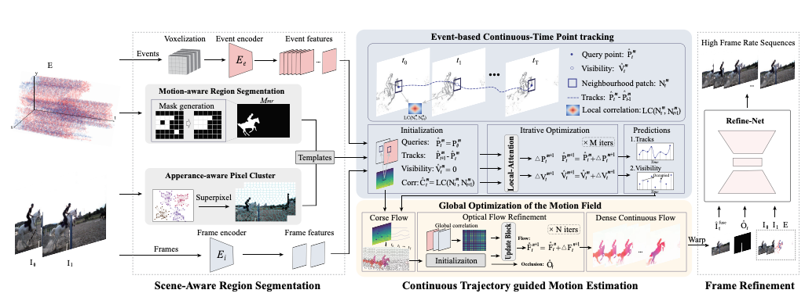

+视频插帧 +连续点追踪 +RGB +数据集

* [**Active Event-based Stereo Vision**](https://openaccess.thecvf.com/content/CVPR2025/papers/Li_Active_Event-based_Stereo_Vision_CVPR_2025_paper.pdf)

> Conventional frame-based imaging for active stereo systems has encountered major challenges in fast-motion scenarios. However, how to design a novel paradigm for highspeed depth sensing still remains an open issue. In this paper, we propose a novel problem setting, namely active event-based stereo vision, which provides the first insight of integrating binocular event cameras and an infrared projector for high-speed depth sensing. Technically, we first build a stereo camera prototype system and present a real-world dataset with over 21.5k spatiotemporal synchronized labels at 15 Hz, while also creating a realistic synthetic dataset with stereo event streams and 23.8k synchronized labels at 20 Hz. Then, we propose ActiveEventNet, a lightweight yet effective active event-based stereo matching neural network that learns to generate high-quality dense disparity maps from stereo event streams with low latency. Experiments demonstrate that our ActiveEventNet outperforms state-of-the-art methods meanwhile significantly reducing computational complexity. Our solution offers superior depth sensing compared to conventional stereo cameras in high-speed scenes, while also achieving the inference speed of up to 150 FPS with our prototype. We believe that this novel paradigm will provide new insights into future depth sensing systems. Our project can be available at https://github.com/jianing-li/active_event_based_stereo

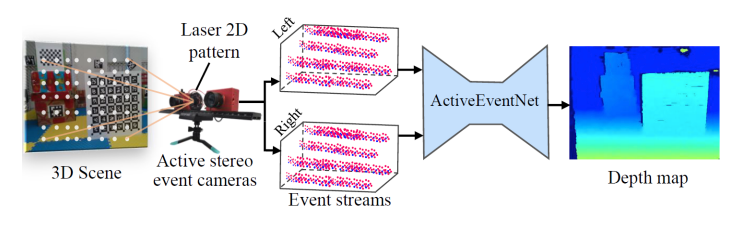

1. “**Structured Light（结构光）**”是一种**主动视觉技术**，用于**三维重建**、**物体识别**、**深度感知**等场景。它通过**投影已知模式的光线到物体表面**，并通过相机观察这些模式如何变形，从而反推出物体的形状或深度。

+深度估计 +结构光 +数据集

- **[Bridge Frame and Event: Common Spatiotemporal Fusion for High-Dynamic Scene Optical Flow](https://hyzhouboy.github.io/)**

> High-dynamic scene optical flow is a challenging task, which suffers spatial blur and temporal discontinuous motion due to large displacement in frame imaging, thus deteriorating the spatiotemporal feature of optical flow. Typically, existing methods mainly introduce event camera to directly fuse the spatiotemporal features between the two modalities. However, this direct fusion is ineffective, since there exists a large gap due to the heterogeneous data representation between frame and event modalities. To address this issue, we explore a common-latent space as an intermediate bridge to mitigate the modality gap. In this work, we propose a novel common spatiotemporal fusion between frame and event modalities for high-dynamic scene optical flow, including visual boundary localization and motion correlation fusion. Specifically, in visual boundary localization, we figure out that frame and event share the similar spatiotemporal gradients, whose similarity distribution is consistent with the extracted boundary distribution. This motivates us to design the common spatiotemporal gradient to constrain the reference boundary localization. In motion correlation fusion, we discover that the frame-based motion possesses spatially dense but temporally discontinuous correlation, while the event-based motion has spatially sparse but temporally continuous correlation. This inspires us to use the reference boundary to guide the complementary motion knowledge fusion between the two modalities. Moreover, common spatiotemporal fusion can not only relieve the cross-modal feature discrepancy, but also make the fusion process interpretable for dense and continuous optical flow. Extensive experiments have been performed to verify the superiority of the proposed method.

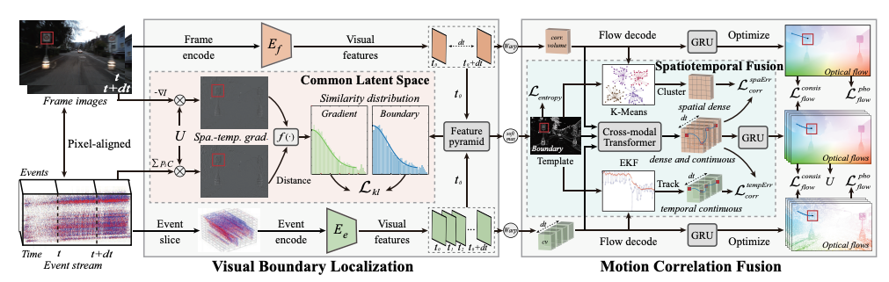

+光流估计 +RGB

- [**Event Fields: Capturing Light Fields at High Speed, Resolution, and Dynamic Range**](https://arxiv.org/pdf/2412.06191)

> Event cameras, which feature pixels that independently respond to changes in brightness, are becoming increasingly popular in high-speed applications due to their lower latency, reduced bandwidth requirements, and enhanced dynamic range compared to traditional frame-based cameras. Numerous imaging and vision techniques have leveraged event cameras for high-speed scene understanding by capturing high-framerate, high-dynamic range videos, primarily utilizing the temporal advantages inherent to event cameras. Additionally, imaging and vision techniques have utilized the light field—a complementary dimension to temporal information—for enhanced scene understanding. In this work, we propose “Event Fields”, a new approach that utilizes innovative optical designs for event cameras to capture light fields at high speed. We develop the underlying mathematical framework for Event Fields and introduce two foundational frameworks to capture them practically: spatial multiplexing to capture temporal derivatives and temporal multiplexing to capture angular derivatives. To realize these, we design two complementary optical setups— one using a kaleidoscope[1] for spatial multiplexing and another using a galvanometer[2] for temporal multiplexing. We evaluate the performance of both designs using a custombuilt simulator and real hardware prototypes, showcasing their distinct benefits. Our event fields unlock the full advantages of typical light fields—like post-capture refocusing and depth estimation—now supercharged for high-speed and high-dynamic range scenes. This novel light-sensing paradigm opens doors to new applications in photography, robotics, and AR/VR, and presents fresh challenges in rendering and machine learning.

1. **Kaleidoscope（万花筒）** 在计算机视觉、光学和三维重建领域中，指的是**一种利用镜面反射构造多视角的特殊成像系统**
2. **Galvanometer（振镜）** = 一个能控制小镜子转动角度的“伺服马达”，通过它可以非常精准地控制光束的扫描方向。

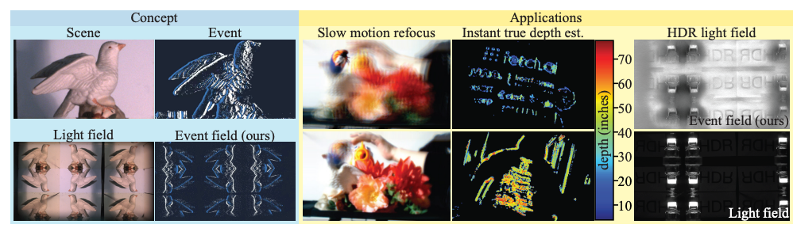

+Highlight +光场

- [**Asynchronous Collaborative Graph Representation for Frames and Events**](https://openaccess.thecvf.com/content/CVPR2025/papers/Li_Asynchronous_Collaborative_Graph_Representation_for_Frames_and_Events_CVPR_2025_paper.pdf)

> Integrating frames and events has become a widely accepted solution for various tasks in challenging scenarios. However, most multimodal methods directly convert events into image-like formats synchronized with frames and process each stream through separate two-branch backbones, making it difficult to fully exploit the spatiotemporal events while limiting inference frequency to the frame rate. To address these problems, we propose a novel asynchronous collaborative graph representation, namely ACGR, which is the first trial to explore a unified graph framework for asynchronously processing frames and events with high performance and low latency. Technically, we first construct unimodal graphs for frames and events to preserve their spatiotemporal properties and sparsity. Then, an asynchronous collaborative alignment module is designed to align and fuse frames and events into a unified graph and the ACGR is generated through graph convolutional networks. Finally, we innovatively introduce domain adaptation to enable cross-modal interactions between frames and events by aligning their feature spaces. Experimental results show that our approach outperforms state-of-the-art methods in both object detection and depth estimation tasks, while significantly reducing computational latency and achieving real-time inference up to 200 Hz. Our code can be available at https://github.com/dianzl/ACGR.

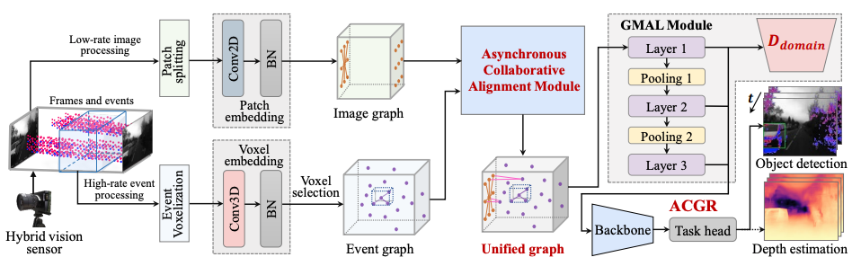

+GNN +RGB +领域自适应

- **[EventFly: Event Camera Perception from Ground to the Sky](https://event-fly.github.io/)**

> Cross-platform adaptation in event-based dense perception is crucial for deploying event cameras across diverse settings, such as vehicles, drones, and quadrupeds, each with unique motion dynamics, viewpoints, and class distributions. In this work, we introduce EventFly, a framework for robust cross-platform adaptation in event camera perception. Our approach comprises three key components: i) Event Activation Prior (EAP), which identifies highactivation regions in the target domain to minimize prediction entropy, fostering confident, domain-adaptive predictions; ii) EventBlend, a data-mixing strategy that integrates source and target event voxel grids based on EAP-driven similarity and density maps, enhancing feature alignment; and iii) EventMatch, a dual-discriminator technique that aligns features from source, target, and blended domains for better domain-invariant learning. To holistically assess cross-platform adaptation abilities, we introduce EXPo, a large-scale benchmark with diverse samples across vehicle, drone, and quadruped platforms. Extensive experiments validate our effectiveness, demonstrating substantial gains over popular adaptation methods. We hope this work can pave the way for more adaptive, high-performing event perception across diverse and complex environments.

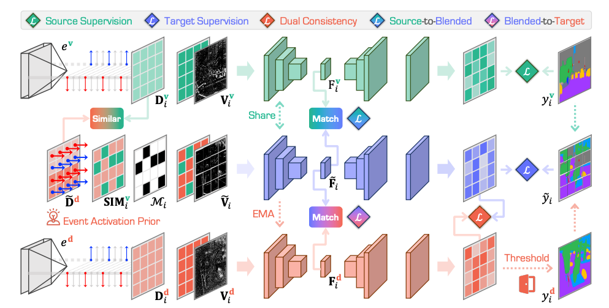

+领域自适应 +Benchmark

- **[ETAP: Event-based Tracking of Any Point](https://github.com/tub-rip/ETAP)**

> Tracking any point (TAP) recently shifted the motion estimation paradigm from focusing on individual salient points with local templates to tracking arbitrary points with global image contexts. However, while research has mostly focused on driving the accuracy of models in nominal settings, addressing scenarios with difficult lighting conditions and high-speed motions remains out of reach due to the limitations of the sensor. This work addresses this challenge with the first event camera-based TAP method. It leverages the high temporal resolution and high dynamic range of event cameras for robust high-speed tracking, and the global contexts in TAP methods to handle asynchronous and sparse event measurements. We further extend the TAP framework to handle event feature variations induced by motion — thereby addressing an open challenge in purely event-based tracking — with a novel feature alignment-loss which ensures the learning of motion-robust features. Our method is trained with data from a new data generation pipeline and systematically ablated across all design decisions. Our method shows strong cross-dataset generalization and performs 136% better on the average Jaccard metric than the baselines. Moreover, on an established feature tracking benchmark, it achieves a 20% improvement over the previous best event-only method and even surpasses the previous best events-and-frames method by 4.1%. Our code is available at https://github.com/tub-rip/ETAP.

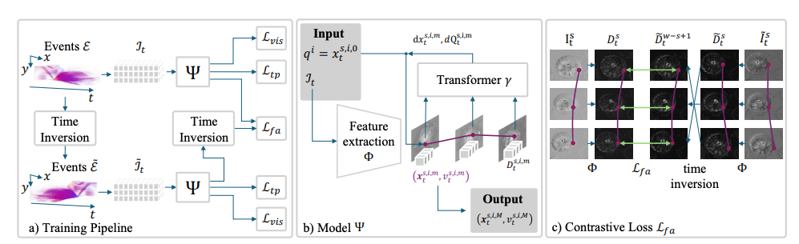

+Highlight +点追踪 +运动估计

- [**Event-based Video Super-Resolution via State Space Models** ](https://openaccess.thecvf.com/content/CVPR2025/papers/Xiao_Event-based_Video_Super-Resolution_via_State_Space_Models_CVPR_2025_paper.pdf)

> Exploiting temporal correlations is crucial for video super-resolution (VSR). Recent approaches enhance this by incorporating event cameras. In this paper, we introduce MamEVSR, a Mamba-based network for event-based VSR that leverages the selective state space model, Mamba. MamEVSR stands out by offering global receptive field coverage with linear computational complexity, thus addressing the limitations of convolutional neural networks and Transformers. The key components of MamEVSR include: (1) The interleaved Mamba (iMamba) block, which interleaves tokens from adjacent frames and applies multidirectional selective state space modeling, enabling efficient feature fusion and propagation across bi-directional frames while maintaining linear complexity. (2) The crossmodality Mamba (cMamba) block facilitates further interaction and aggregation between event information and the output from the iMamba block. The cMamba block can leverage complementary spatio-temporal information from both modalities and allows MamEVSR to capture finer motion details. Experimental results show that the proposed MamEVSR achieves superior performance on various datasets quantitatively and qualitatively.

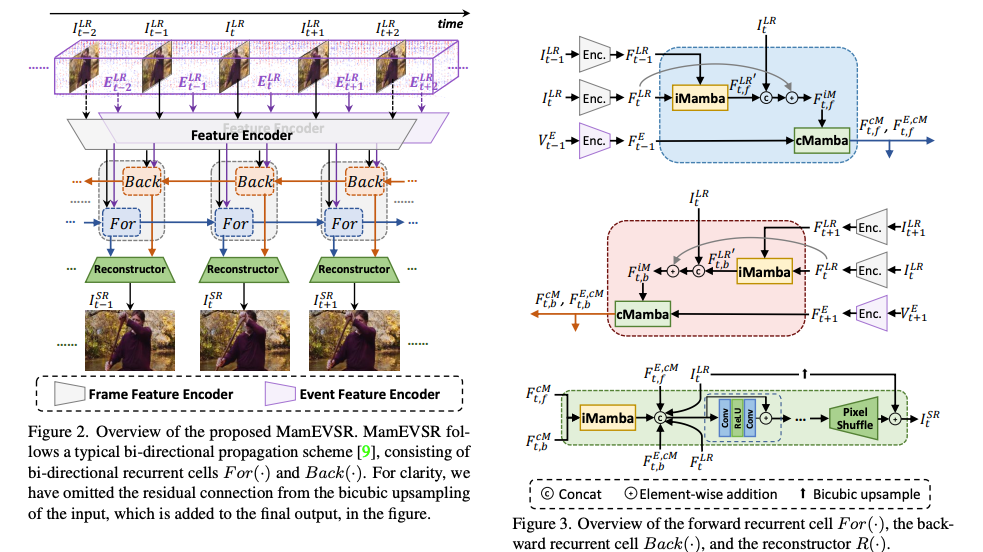

+视频超分 +Mamba

- [**Ev-3DOD: Pushing the Temporal Boundaries of 3D Object Detection with Event Cameras** ](https://arxiv.org/pdf/2502.19630)

> Detecting 3D objects in point clouds plays a crucial role in autonomous driving systems. Recently, advanced multimodal methods incorporating camera information have achieved notable performance. For a safe and effective autonomous driving system, algorithms that excel not only in accuracy but also in speed and low latency are essential. However, existing algorithms fail to meet these requirements due to the latency and bandwidth limitations of fixed frame rate sensors, e.g., LiDAR and camera. To address this limitation, we introduce asynchronous event cameras into 3D object detection for the first time. We leverage their high temporal resolution and low bandwidth to enable high-speed 3D object detection. Our method enables detection even during inter-frame intervals when synchronized data is unavailable, by retrieving previous 3D information through the event camera. Furthermore, we introduce the first event-based 3D object detection dataset, DSEC3DOD, which includes ground-truth 3D bounding boxes at 100 FPS, establishing the first benchmark for eventbased 3D detectors. The code and dataset are available at https://github.com/mickeykang16/Ev3DOD.

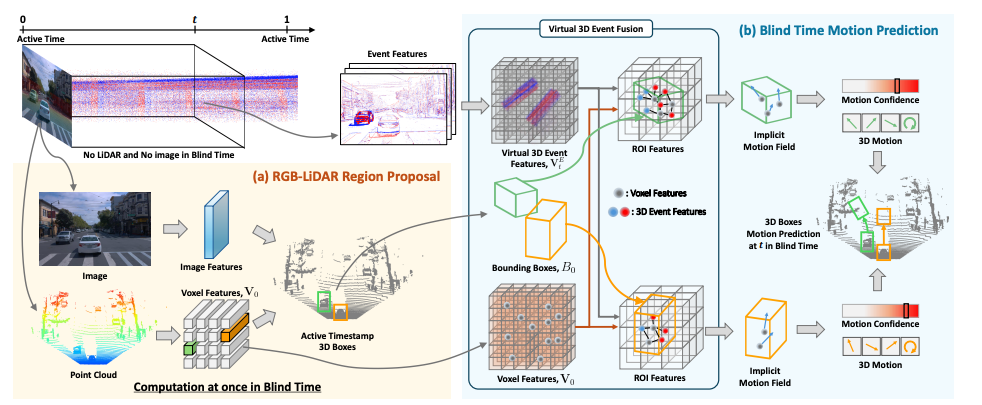

+Highlight +目标检测 +RGB +点云 +数据集

- [**EDCFlow: Exploring Temporally Dense Difference Maps for Event-based Optical Flow Estimation** ](https://openaccess.thecvf.com/content/CVPR2025/papers/Liu_EDCFlow_Exploring_Temporally_Dense_Difference_Maps_for_Event-based_Optical_Flow_CVPR_2025_paper.pdf)

> Recent learning-based methods for event-based optical flow estimation utilize cost volumes for pixel matching but suffer from redundant computations and limited scalability to higher resolutions for flow refinement. In this work, we take advantage of the complementarity between temporally dense feature differences of adjacent event frames and cost volume and present a lightweight event-based optical flow network (EDCFlow) to achieve high-quality flow estimation at a higher resolution. Specifically, an attentionbased multi-scale temporal feature difference layer is developed to capture diverse motion patterns at high resolution in a computation-efficient manner. An adaptive fusion of high-resolution difference motion features and lowresolution correlation motion features is performed to enhance motion representation and model generalization. Notably, EDCFlow can serve as a plug-and-play refinement module for RAFT-like event-based methods to enhance flow details. Extensive experiments demonstrate that EDCFlow achieves better performance with lower complexity compared to existing methods, offering superior generalization. Codes and models will be available at here.

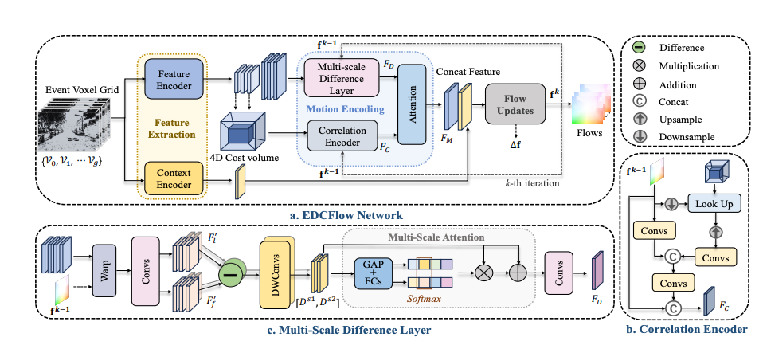

+光流估计

- **[One-Step Event-Driven High-Speed Autofocus](https://github.com/YuHanBaozju/ELP)**

- **[DiET-GS: Diffusion Prior and Event Stream-Assisted Motion Deblurring 3D Gaussian Splatting](https://diet-gs.github.io/)**
- **Unified Reconstruction of Static and Dynamic Scenes from Events**
- **Is Your World Simulator a Good Story Presenter? A Consecutive Events-Based Benchmark for Future Long Video Generation** 
- **EventGPT: Event Stream Understanding with Multimodal Large Language Models** 

